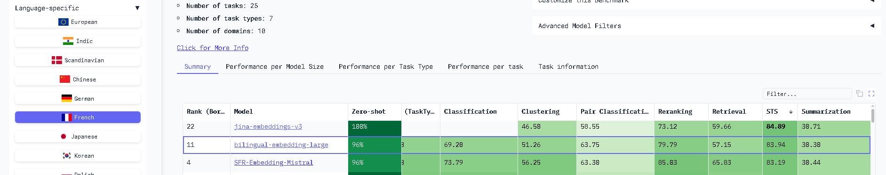

# 1.Data cleaning

- We first verify the existence of redundant entries in the data.
- Rows with missing values (no category) are eliminated.
- Scientific names, such as _Musa paradisiaca_ (bananas) or _Bos spp._ (beef), do not help our keyword-based approach and can introduce noise. Therefore, we remove them. These names are always added between parentheses as extra details in the data, so we use a regular expression to remove them.
- Special characters such as %, ?, etc., are cleaned, and all text is converted to lowercase.
- Stopwords are eliminated to facilitate keyword extraction and reduce noise in the data.
- Adjectives or verbs, are not relevant as keywords such as _aromatisée_, _semblables_, and _instantané_ to exclude them we keep only `NOUN` (Common noun) and `PROPN` (Proper noun). For this, we use a `POS` (Part-of-Speech) technique to detect them with a SpaCy model, [fr_dep_news_trf](https://github.com/explosion/spacy-models/releases/tag/fr_dep_news_trf-3.8.0), based on a transformer pipeline, which performs much better than other models in SpaCy for french.
- The final cleaning step is to remove redundant words in product names or categories.

-> The results of _Data cleaning_ stage are in _data/train_cleaned.xlsx_ and _data/test_cleaned.xlsx_

# 2.Classification

## 2.1 Evaluation function

- Some products in the test data already appear in the training set, so we map their corresponding categories from the training data before starting the manual annotation of new products. Then we annoutate remained products.

## 2.2 Keywords based Pre-Selection

- The process works as follows: each product name is split into keywords. If a keyword appears in a category, this one is considered a candidate.
- Some products have rare names that do not appear in the categories keywords, so they end up with no candidates.
- If a product has only one candidate, there is no need for the refinement step, as the predicted category is already determined.

-> The results are in _data/train_with_candidates.xlsx_ and _data/test_with_candidates.xlsx_

## 2.3 Embeddings model approach

The logic is:

1. **If `Category_predicted` is already filled** (from the keyword rules stage, like _“chocapic poudre”_ → `poudre cacao`), keep it.

2. **If not filled**:

   - If `Candidate_categories` is non-empty → compute the similarity between the embedding of `Product_clean` and the embeddings of each candidate category.
   - If `Candidate_categories` is empty → compute similarity with **all unique categories** from the training set (`Category_clean`).
   - The predicted category is the one with the highest cosine similarity.

### Embeddings model choice

- We relied on an open-source embedding models [leaderboard](https://huggingface.co/spaces/mteb/leaderboard) on Hugging Face. On the leaderboard, we selected the French language and focused only on the STS (Semantic Textual Similarity) task. Sorting by descending performance, we found that the best model was jina-embeddings-v3; however, we encountered unresolved errors during installation. As a result, we chose the second-best model, [bilingual-embedding-large](https://huggingface.co/Lajavaness/bilingual-embedding-large).

- This approach achieved an **accuracy** of **0.63** on the training data and **0.62** on the test data. The values are very close because both datasets are highly similar.
